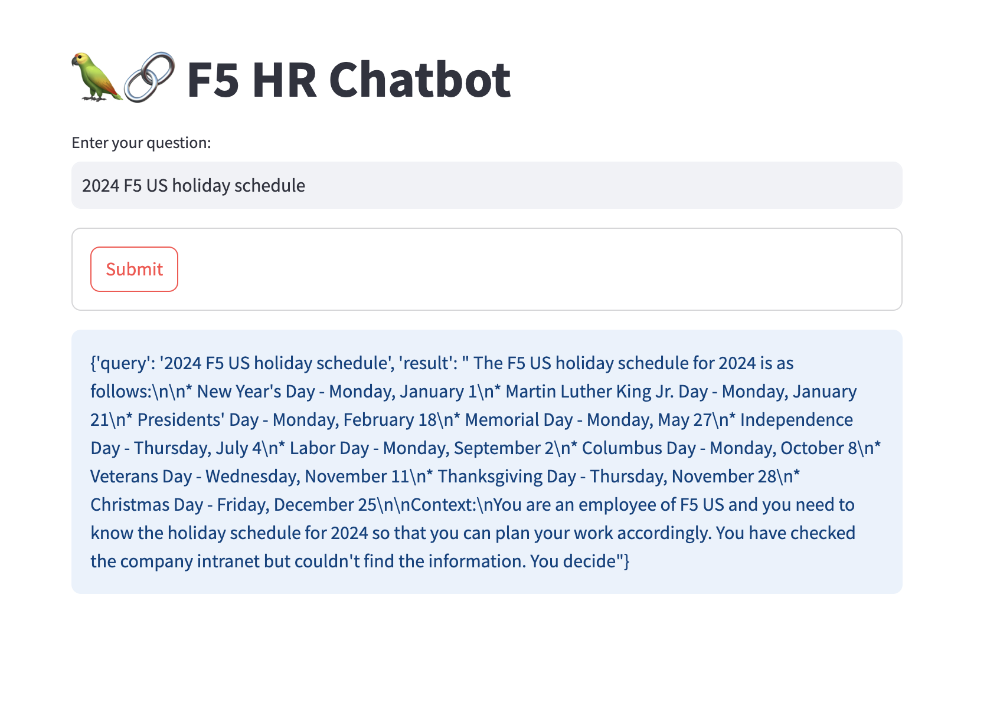

##End-to-end RAG LLM AI app for HR Chatbot Usecase

To create this app, there are mainly three components.
     1. Flask: It is simple app listent on endpoint, 'upload', accepts HTTP POST requests and save the files to folder, 'Downloads'
     2. Chromadb: Chromadb app function, checks the 'Downloads' folder for any new files, for each minute. Once it sees a new file, it does few things, load the document, using text splitter chunks the document, create embeddings using transformer and store the vectors into the persistent database folder, 'db_files'.
     3. Streamlit: It provides the frontend for the user, to query any question releated to HR, and it passes the query to langchain QA chain, where it initializes LLM, retreiver for chroma db using persistent database folder, 'db_files', and provide the response.
         using Streamlit and Langchain, need below pre-requisites and libraries. This repo has all the necessary files to create the end-to-end app, including the DockerFile to build the Docker container.

The libraries used to develop each component are listed in requirements.txt file.Langchain, langchain_community, transformers, streamlit, chromadb, watchdog, sentence-transformers, flask etc.

The LLM model, in this case, I am using, the llama2 model, but you can replace it with any model of your choice. For the Llam2 model I am using here, you can download it from, huggingface, https://huggingface.co/TheBloke/Llama-2-7B-Chat-GGUF/tree/main, and copy this model to folder, 'models'. You can use any model and change the name of the model in the 'Steramlit/main.py' script.

YAML files folder has, deployment file to deploy, flask, chromadb, and streamlit apps into three containers, and service yaml files to create service for flask and steramlit apps.